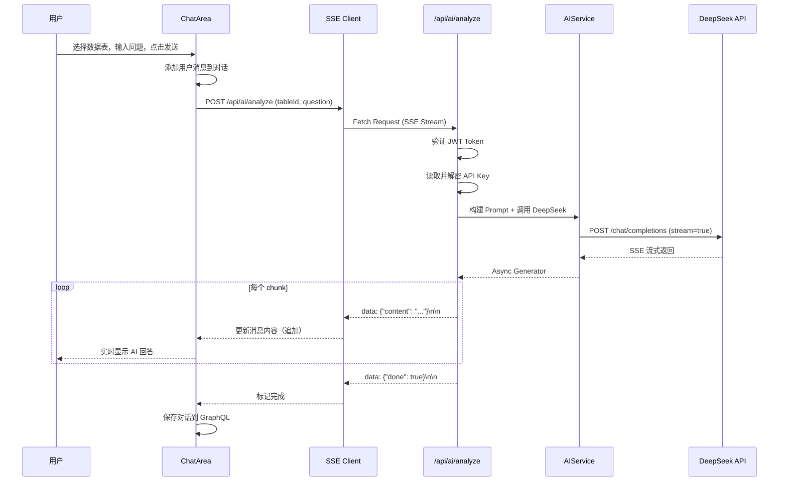
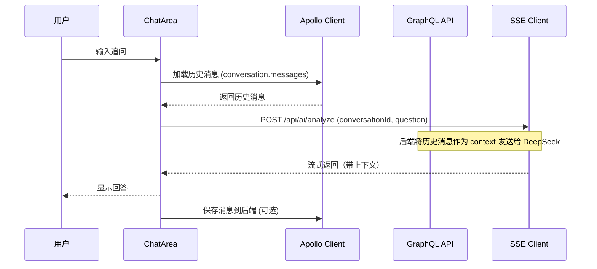

# QTable AI 辅助模块 - 系统架构设计

**架构师**: 高见远 (Gao)  
**版本**: v1.0  
**日期**: 2026-05-09

---

## 1. 实现方案 + 框架选型

### 1.1 前端架构

#### 组件拆分
```
AiAssistant (主抽屉组件)
├── AiConfigModal (API Key 配置弹窗)
├── ConversationList (历史对话列表 - P1)
├── ChatArea (对话区域)
│   ├── Bubble (消息气泡 - Ant Design X)
│   └── Thinking (推理过程 - Ant Design X)
├── TableSelector (数据表选择器)
└── Sender (输入区域 - Ant Design X)
```

#### 状态管理方案 (Zustand)
- **Store 名称**: `aiAssistantStore`
- **职责**: 
  - 管理抽屉打开/关闭状态
  - 管理对话历史（多轮对话支持）
  - 管理流式响应状态（loading, streaming, done）
  - 管理 API Key 配置状态
  - 管理选择的数据表

#### SSE 实现方案（选择 SSE 的理由）
**选择 SSE (Server-Sent Events) 而非 WebSocket 的理由**：
1. **单向通信足够**：AI 分析是单向的（用户发问 → AI 回答），不需要双向实时通信
2. **更简单**：SSE 基于 HTTP，无需 WebSocket 握手和协议升级
3. **自动重连**：浏览器原生支持 SSE 重连机制
4. **与 GraphQL 互补**：配置类 API 用 GraphQL，流式响应用 SSE REST endpoint
5. **DeepSeek API 本身就是 SSE**：DeepSeek `/chat/completions` stream 返回的就是 SSE 格式

#### 前端 SSE 消费方案
```typescript
// 使用 Fetch API + ReadableStream 消费 SSE
// 不使用 EventSource（因为需要 POST 且带 Body）
const response = await fetch('/api/ai/analyze', {
  method: 'POST',
  headers: {
    'Authorization': `Bearer ${token}`,
    'Content-Type': 'application/json'
  },
  body: JSON.stringify({ tableId, question, conversationId })
});
const reader = response.body.getReader();
// 解析 SSE data: {...}\n\n 格式
```

### 1.2 后端架构

#### API 设计
| 类型 | 路径/操作 | 用途 |
|------|----------|------|
| GraphQL Mutation | `saveAiConfig` | 保存 API Key（加密） |
| GraphQL Query | `aiConfig` | 获取当前配置状态 |
| GraphQL Mutation | `deleteAiConfig` | 删除 API Key |
| GraphQL Mutation | `createConversation` | 创建新对话 |
| GraphQL Query | `conversations` | 获取对话历史列表 |
| GraphQL Mutation | `deleteConversation` | 删除对话 |
| REST POST | `/api/ai/analyze` | SSE 流式分析端点 |
| REST GET | `/api/ai/analyze/stream` | SSE EventSource 备选 |

#### Stream 实现方案
- **后端**: FastAPI 返回 `StreamingResponse`
- **流式格式**: SSE (`data: {...}\n\n`)
- **DeepSeek 集成**: 使用 `openai` Python SDK（支持 DeepSeek）
- **超时处理**: 30 秒无数据发送心跳 `data: {"type":"ping"}\n\n`

### 1.3 DeepSeek API 集成方案

```python
# 使用 OpenAI SDK 兼容模式（DeepSeek 兼容 OpenAI API）
from openai import AsyncOpenAI

client = AsyncOpenAI(
    api_key=decrypted_api_key,
    base_url="https://api.deepseek.com"
)

stream = await client.chat.completions.create(
    model="deepseek-chat",
    messages=[
        {"role": "system", "content": SYSTEM_PROMPT},
        *conversation_history,
        {"role": "user", "content": user_prompt}
    ],
    stream=True
)

# 异步迭代 stream
async for chunk in stream:
    content = chunk.choices[0].delta.content
    if content:
        yield f"data: {json.dumps({'content': content})}\n\n"
```

### 1.4 技术选型总结

| 层级 | 技术选型 | 理由 |
|------|---------|------|
| 前端框架 | React 19 + TypeScript | 现有栈 |
| UI 组件 | Ant Design X + antd | PRD 要求，Bubble/Sender 组件 |
| 状态管理 | Zustand | 现有栈，轻量级 |
| GraphQL Client | Apollo Client | 现有栈 |
| SSE 消费 | Fetch + ReadableStream | 支持 POST + Body |
| 后端框架 | FastAPI | 现有栈，原生 async 支持 |
| GraphQL Server | Strawberry | 现有栈 |
| SSE 生产 | StreamingResponse | FastAPI 原生支持 |
| DeepSeek SDK | openai (Async) | DeepSeek 兼容 OpenAI API |
| 加密 | cryptography (Fernet) | AES-256 加密 API Key |
| 数据库 | PostgreSQL/SQLite | 现有栈 |

---

## 2. 文件列表及相对路径

### 2.1 后端文件（新增/修改）

```
app/
├── models/
│   ├── ai_config.py          # NEW: AI 配置模型
│   ├── ai_conversation.py    # NEW: 对话模型
│   └── ai_message.py         # NEW: 消息模型
├── schemas/
│   └── ai.py                # NEW: GraphQL Schema 定义
├── services/
│   ├── ai_service.py        # NEW: DeepSeek 集成服务
│   └── encryption.py        # NEW: API Key 加密服务
├── api/
│   ├── ai.py                # NEW: SSE 流式端点
│   └── graphql.py           # MODIFY: 添加 AI GraphQL Schema
└── core/
    └── config.py             # MODIFY: 添加 AI 相关配置项
```

### 2.2 前端文件（新增/修改）

```
ui/src/
├── components/
│   └── AiAssistant/
│       ├── index.tsx              # NEW: 主抽屉组件
│       ├── AiConfigModal.tsx      # NEW: API Key 配置弹窗
│       ├── ChatArea.tsx           # NEW: 对话区域
│       ├── TableSelector.tsx      # NEW: 数据表选择器
│       └── ConversationList.tsx   # NEW: 历史对话列表 (P1)
├── store/
│   └── aiAssistantStore.ts       # NEW: Zustand store
├── lib/
│   └── aiApi.ts                 # NEW: SSE 消费工具函数
├── graphql/
│   └── ai.ts                    # NEW: GraphQL 查询/mutation 定义
└── App.tsx                       # MODIFY: 添加 AI 辅助按钮
```

### 2.3 数据库迁移文件（如适用）

```
app/
└── migrations/
    └── versions/
        └── add_ai_tables.py      # NEW: 数据库迁移
```

---

## 3. 数据结构和接口

### 3.1 前端 TypeScript 类型定义

```typescript
// ui/src/types/ai.types.ts

/** AI 配置状态 */
export interface AiConfigStatus {
  configured: boolean;
  provider: 'deepseek' | 'openai' | 'claude';
  model: string;
}

/** 对话消息 */
export interface AiMessage {
  id: string;
  role: 'user' | 'assistant' | 'system';
  content: string;
  timestamp: string;
}

/** 对话会话 */
export interface AiConversation {
  id: string;
  tableId: string;
  tableName?: string;
  title: string;
  messages: AiMessage[];
  createdAt: string;
  updatedAt: string;
}

/** SSE 事件类型 */
export interface SSEEvent {
  type: 'content' | 'done' | 'error' | 'ping';
  content?: string;
  message?: string;
}

/** 流式分析请求 */
export interface AnalyzeRequest {
  tableId: string;
  question: string;
  conversationId?: string;
}

/** 流式分析响应（SSE 格式） */
// SSE 格式: data: { "content": "...", "done": false }\n\n
```

### 3.2 后端 Python 数据模型

```python
# app/models/ai_config.py
import uuid
from sqlalchemy import Column, String, DateTime, ForeignKey, Text
from sqlalchemy.dialects.postgresql import UUID
from sqlalchemy.sql import func
from app.db.base import Base

class AiConfig(Base):
    __tablename__ = "ai_config"
    
    id = Column(UUID(as_uuid=True), primary_key=True, default=uuid.uuid4)
    user_id = Column(UUID(as_uuid=True), ForeignKey("users.id"), nullable=False)
    provider = Column(String(50), default="deepseek", nullable=False)
    api_key_encrypted = Column(Text, nullable=False)  # Fernet 加密
    model = Column(String(100), default="deepseek-chat")
    created_at = Column(DateTime(timezone=True), server_default=func.now())
    updated_at = Column(DateTime(timezone=True), onupdate=func.now())
    
    __table_args__ = (
        UniqueConstraint("user_id", "provider", name="uq_user_provider"),
    )

# app/models/ai_conversation.py
class AiConversation(Base):
    __tablename__ = "ai_conversations"
    
    id = Column(UUID(as_uuid=True), primary_key=True, default=uuid.uuid4)
    user_id = Column(UUID(as_uuid=True), ForeignKey("users.id"), nullable=False)
    table_id = Column(String(50), nullable=True)  # 支持 file backend
    title = Column(String(255), nullable=False)
    created_at = Column(DateTime(timezone=True), server_default=func.now())
    updated_at = Column(DateTime(timezone=True), onupdate=func.now())

# app/models/ai_message.py
class AiMessage(Base):
    __tablename__ = "ai_messages"
    
    id = Column(UUID(as_uuid=True), primary_key=True, default=uuid.uuid4)
    conversation_id = Column(UUID(as_uuid=True), ForeignKey("ai_conversations.id"), nullable=False)
    role = Column(String(20), nullable=False)  # user, assistant, system
    content = Column(Text, nullable=False)
    created_at = Column(DateTime(timezone=True), server_default=func.now())
```

### 3.3 GraphQL Schema

```graphql
# app/schemas/ai.py

type AiConfig {
  id: ID!
  provider: String!
  model: String!
  createdAt: String!
  updatedAt: String!
}

type AiMessage {
  id: ID!
  role: String!
  content: String!
  createdAt: String!
}

type AiConversation {
  id: ID!
  tableId: String
  title: String!
  messages: [AiMessage!]!
  createdAt: String!
  updatedAt: String!
}

input AiConfigInput {
  provider: String!
  apiKey: String!
  model: String
}

extend type Query {
  aiConfig: AiConfig
  conversations(tableId: String): [AiConversation!]!
  conversation(id: ID!): AiConversation
}

extend type Mutation {
  saveAiConfig(input: AiConfigInput!): AiConfig!
  deleteAiConfig: Boolean!
  createConversation(tableId: String, title: String): AiConversation!
  deleteConversation(id: ID!): Boolean!
  clearConversationMessages(id: ID!): Boolean!
}
```

---

## 4. 程序调用流程（时序图）

### 4.1 配置 API Key 流程

```mermaid
sequenceDiagram
    participant U as 用户
    participant UI as AiConfigModal
    participant AC as Apollo Client
    participant GQL as GraphQL API
    participant SVC as EncryptionService
    DB as PostgreSQL

    U->>UI: 点击"配置"按钮
    UI->>UI: 显示配置弹窗
    U->>UI: 输入 API Key，点击保存
    UI->>AC: 调用 saveAiConfig mutation
    AC->>GQL: POST /graphql (saveAiConfig)
    GQL->>SVC: 加密 API Key (Fernet)
    SVC->>DB: INSERT/UPDATE ai_config
    DB-->>GQL: 成功
    GQL-->>AC: 返回 AiConfig
    AC-->>UI: 更新状态
    UI-->>U: 显示"配置成功"
```

### 4.2 发送分析问题 + 接收流式响应



### 4.3 多轮对话流程



---

## 5. 任务列表（有序、含依赖关系）

### 任务依赖关系图
```
T1 (DB Models) ──→ T2 (Encryption Service) ──→ T3 (GraphQL Schema)
                     │                            │
                     └──────────┬─────────────────┘
                                ↓
                     T4 (SSE Endpoint) ←── T5 (AI Service)
                                │
                                ↓
                     T6 (Frontend Store) ──→ T7 (Config Modal)
                                │                   │
                                ↓                   ↓
                     T8 (Chat Area) ←───────────────┘
                                │
                                ↓
                     T9 (Main Drawer) ──→ T10 (App Integration)
```

### 详细任务列表

| ID | 任务描述 | 涉及文件 | 依赖 | 预估工时 |
|----|---------|---------|------|---------|
| **T1** | 创建数据库模型 (AiConfig, AiConversation, AiMessage) | `app/models/ai_config.py`, `app/models/ai_conversation.py`, `app/models/ai_message.py`, 数据库迁移 | 无 | 0.5天 |
| **T2** | 实现 API Key 加密服务 | `app/services/encryption.py`, `app/core/config.py` (添加 ENCRYPTION_KEY) | T1 | 0.5天 |
| **T3** | 实现 GraphQL Schema (配置 + 对话) | `app/schemas/ai.py`, 修改 `app/api/graphql.py` | T1, T2 | 1天 |
| **T4** | 实现 DeepSeek AI Service | `app/services/ai_service.py` | T2 | 1天 |
| **T5** | 实现 SSE 流式分析端点 | `app/api/ai.py`, 修改 `app/main.py` (注册路由) | T3, T4 | 1天 |
| **T6** | 实现前端 Zustand Store | `ui/src/store/aiAssistantStore.ts` | 无 | 0.5天 |
| **T7** | 实现 API Key 配置弹窗 | `ui/src/components/AiAssistant/AiConfigModal.tsx`, `ui/src/lib/aiApi.ts` (GraphQL) | T3, T6 | 0.5天 |
| **T8** | 实现对话区域 (ChatArea + SSE 消费) | `ui/src/components/AiAssistant/ChatArea.tsx`, `ui/src/lib/aiApi.ts` (SSE) | T5, T6, T7 | 1.5天 |
| **T9** | 实现主抽屉组件 | `ui/src/components/AiAssistant/index.tsx`, `TableSelector.tsx` | T7, T8 | 0.5天 |
| **T10** | 集成到 App.tsx (添加按钮) | `ui/src/App.tsx` | T9 | 0.5天 |
| **T11** | 联调测试 | - | T1-T10 | 1天 |
| **T12** | P1 功能：历史对话列表 | `ui/src/components/AiAssistant/ConversationList.tsx` | T3, T6 | 0.5天 |

**总计**: 约 7.5 天（不含 P1/P2 功能）

---

## 6. 依赖包列表

### 6.1 前端 package.json 新增依赖

```json
{
  "dependencies": {
    "@ant-design/x": "^1.0.0",  // Ant Design X (Bubble, Sender, Prompts)
    "event-source-polyfill": "^1.0.31"  // 可选：IE11 兼容
  }
}
```

> **注意**: `antd` 已在依赖中，`@ant-design/x` 需要单独安装。

### 6.2 后端 requirements.txt 新增依赖

```txt
# AI Assistant 模块新增依赖
openai>=1.0.0          # DeepSeek 兼容 OpenAI API
cryptography>=42.0.0    # API Key 加密 (Fernet - AES-256)
```

> **注意**: `strawberry-graphql` 和 `fastapi` 已安装。

---

## 7. 共享知识（跨文件约定）

### 7.1 命名规范

| 类型 | 规范 | 示例 |
|------|------|------|
| React 组件 | PascalCase | `AiAssistant`, `ChatArea` |
| Zustand Store | camelCase + `Store` 后缀 | `aiAssistantStore` |
| GraphQL Query | camelCase | `aiConfig`, `conversations` |
| GraphQL Mutation | camelCase | `saveAiConfig`, `createConversation` |
| SSE Endpoint | kebab-case | `/api/ai/analyze` |
| Python 函数 | snake_case | `save_ai_config`, `stream_analyze` |
| Python 类 | PascalCase | `AiConfig`, `AIService` |
| 数据库表 | snake_case (plural) | `ai_config`, `ai_conversations`, `ai_messages` |

### 7.2 API 端点设计

#### GraphQL 端点（配置类）
```
POST /graphql
- saveAiConfig(input: AiConfigInput!): AiConfig!
- deleteAiConfig: Boolean!
- createConversation(tableId: String, title: String): AiConversation!
- deleteConversation(id: ID!): Boolean!
- aiConfig: AiConfig
- conversations(tableId: String): [AiConversation!]!
```

#### REST 端点（流式分析）
```
POST /api/ai/analyze
Content-Type: application/json
Authorization: Bearer <token>

Body:
{
  "tableId": "table1",
  "question": "分析这张表",
  "conversationId": "conv1"  // 可选，用于多轮对话
}

Response: SSE Stream
data: {"content": "根据..."}
data: {"content": "数据分析..."}
data: {"done": true}
```

### 7.3 错误处理规范

#### 后端错误格式（SSE）
```python
# SSE 错误格式
data: {"error": true, "message": "API Key 未配置", "code": "API_KEY_MISSING"}
data: {"error": true, "message": "DeepSeek API 调用失败", "code": "DEEPSEEK_ERROR"}
```

#### 后端错误格式（GraphQL）
```python
# GraphQL 错误通过 Strawberry 抛出
raise GraphQLError("API Key 未配置")
```

#### 前端错误处理
```typescript
// SSE 错误
if (data.error) {
  notification.error({ message: data.message });
}

// GraphQL 错误
catch (error) {
  notification.error({ message: error.message });
}
```

### 7.4 加密存储方案（API Key）

```python
# app/services/encryption.py
from cryptography.fernet import Fernet
from app.core.config import settings

def get_encryption_key() -> bytes:
    """从环境变量获取或生成加密密钥"""
    key = settings.ENCRYPTION_KEY
    if key:
        return key.encode()
    # 首次运行时生成并提示保存到 .env
    return Fernet.generate_key()

def encrypt_api_key(api_key: str) -> str:
    """加密 API Key"""
    fernet = Fernet(get_encryption_key())
    encrypted = fernet.encrypt(api_key.encode())
    return encrypted.decode()

def decrypt_api_key(encrypted_key: str) -> str:
    """解密 API Key"""
    fernet = Fernet(get_encryption_key())
    decrypted = fernet.decrypt(encrypted_key.encode())
    return decrypted.decode()
```

**.env 配置项**:
```env
# API Key 加密密钥 (Fernet key)
# 生成命令: python -c "from cryptography.fernet import Fernet; print(Fernet.generate_key().decode())"
ENCRYPTION_KEY=your-fernet-key-here
```

### 7.5 系统 Prompt 设计

```python
SYSTEM_PROMPT = """你是一个专业的数据分析助手，专门帮助用户分析表格数据。

规则：
1. 使用中文回答（除非用户使用其他语言）
2. 回答要简洁、专业、有洞察力
3. 如果数据不足以回答，请说明需要哪些额外数据
4. 支持的分析类型：数据摘要、趋势分析、异常检测、相关性分析
5. 可以建议可视化方案（如图表类型）
"""
```

### 7.6 表格数据格式转换

```python
def table_to_markdown(records: list, fields: list) -> str:
    """将 QTable 数据转换为 Markdown 表格，供 DeepSeek 分析"""
    header = "| " + " | ".join(f["name"] for f in fields) + " |"
    separator = "| " + " | ".join("---" for _ in fields) + " |"
    rows = []
    for record in records[:100]:  # 限制前 100 行，避免 token 超限
        row = "| " + " | ".join(str(record.get(f["id"], "")) for f in fields) + " |"
        rows.append(row)
    return "\n".join([header, separator] + rows)
```

---

## 8. 待明确事项

### 8.1 技术相关

1. **DeepSeek API 的具体参数？**
   - 确认 `base_url` 是 `https://api.deepseek.com` 还是 `https://api.deepseek.com/v1`
   - 确认 `deepseek-chat` 是否支持流式返回
   - 确认 token 限制（输入 + 输出）

2. **表格数据大小限制？**
   - 如果表格超过 100 行，如何截断或采样？
   - 如果字段超过 20 列，如何处理？

3. **SSE 端点认证方案？**
   - 使用 JWT Bearer Token（与 GraphQL 一致）
   - 或者允许 Session Cookie（如果未来支持）

4. **并发限制？**
   - 每个用户同时只能有 1 个活跃 SSE 连接？
   - DeepSeek API 的 RPM/TPM 限制如何处理？

### 8.2 产品相关

5. **是否支持多个 LLM 提供商？**
   - 当前只做 DeepSeek？
   - 数据库 schema 是否预留 `provider` 字段？

6. **数据分析的范围？**
   - 只分析当前视图的数据（已过滤）？
   - 还是分析整个数据表？
   - 是否包含隐藏字段？

7. **对话历史的保留策略？**
   - 保留多久？
   - 是否有存储限制（如每对话最多 50 条消息）？
   - 是否支持导出？

8. **UI 触发的时机？**
   - "AI 辅助" 按钮放在哪里？
   - 顶部工具栏？还是右侧？

---

## 9. 风险和注意事项

### 9.1 安全风险
- **API Key 泄露**：必须加密存储，禁止日志输出
- **Prompt 注入**：用户输入可能尝试注入系统 prompt
- **数据泄露**：表格数据会发送到 DeepSeek API，需告知用户

### 9.2 性能风险
- **大表格处理**：超过 100 行时需采样或汇总
- **SSE 连接超时**：需实现心跳机制
- **DeepSeek API 限流**：需实现重试和降级

### 9.3 兼容性风险
- **Ant Design X 版本**：需确认与 antd 6.x 兼容性
- **React 19 兼容性**：确保 @ant-design/x 支持 React 19

---

## 10. 后续 P1/P2 功能扩展

### P1 功能
- API Key 加密存储（已在 T2 实现）
- 分析历史记录（已在 T1/T3 预留）
- 支持多个数据表切换

### P2 功能
- 预设分析模板（"数据摘要"、"趋势分析" 等）
- 导出分析报告（PDF/Markdown）
- 支持多个 LLM 提供商（OpenAI、Claude）

---

**文档状态**: 草稿，待评审  
**下一步**: 与研发团队评审技术可行性，确认待明确事项
