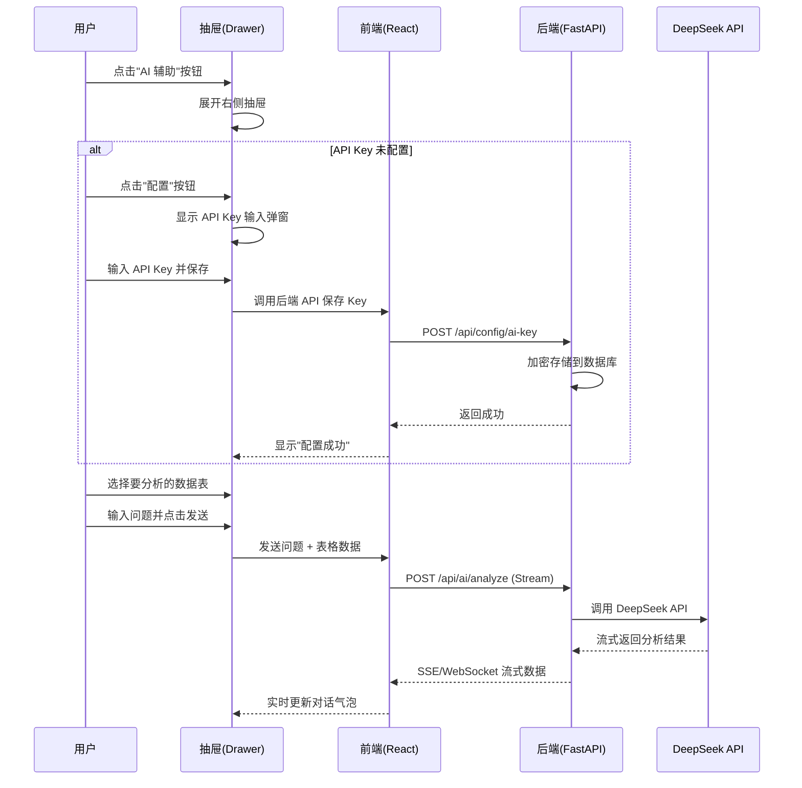

# QTable AI 辅助模块 - 产品需求文档 (PRD)

**版本**: v1.0  
**创建日期**: 2026-05-09  
**产品经理**: 许清楚  
**状态**: 草稿

---

## 1. 产品目标

### 1.1 核心价值主张

QTable AI 辅助模块旨在为用户提供智能化的数据洞察能力，通过集成 DeepSeek 大语言模型，让用户能够：

- **降低数据分析门槛**：无需 SQL 或编程知识，通过自然语言即可分析数据
- **提升决策效率**：快速从数据表中提取趋势、异常和洞察
- **增强用户体验**：在熟悉的表格界面中直接使用 AI 能力，无需切换工具

### 1.2 目标用户画像

| 用户类型 | 特征 | 核心需求 |
|---------|------|---------|
| 业务分析师 | 频繁使用数据表，需要快速洞察 | 快速生成数据摘要、趋势分析 |
| 项目管理者 | 关注项目进度和数据异常 | 异常检测、进度总结 |
| 运营人员 | 需要定期生成数据报告 | 自动化报告生成、数据解读 |

---

## 2. 用户故事

### 2.1 配置 API Key

**作为** 用户，  
**我希望** 能够配置我的 DeepSeek API Key，  
**以便** 系统可以使用 AI 功能进行数据分析。

**验收标准**:
- 用户可以在抽屉中点击"设置"配置 API Key
- 系统将 API Key 安全存储到后端数据库
- 配置成功后显示确认信息
- 支持修改和删除已配置的 API Key

### 2.2 数据分析

**作为** 用户，  
**我希望** 选择当前数据表并发送给 AI 进行分析，  
**以便** 获得数据洞察和解读。

**验收标准**:
- 用户可以选择要分析的数据表（当前表或历史表）
- 系统自动将表格数据转换为适合 AI 处理的格式
- 支持输入自定义问题（如"总结这张表"、"找出异常数据"）
- AI 的回答以流式输出方式实时显示

### 2.3 对话交互

**作为** 用户，  
**我希望** 能够与 AI 进行多轮对话，  
**以便** 深入探索数据并追问细节。

**验收标准**:
- 使用 Ant Design X 的 Bubble 组件显示对话记录
- 支持多轮对话，AI 能理解上下文
- 用户可以复制 AI 的回答
- 支持清空对话记录

---

## 3. 需求池

### P0（必须有 - MVP）

| 需求 ID | 需求描述 | 说明 |
|---------|---------|------|
| P0-1 | 点击"AI 辅助"按钮展开/收起右侧抽屉 | 抽屉宽度 400px，从右侧滑出 |
| P0-2 | 配置 DeepSeek API Key | 存储到后端数据库（users 表或独立配置表） |
| P0-3 | 选择要分析的数据表 | 下拉选择当前用户有权限的表 |
| P0-4 | 将数据表数据发送给 DeepSeek | 构建 prompt，调用 DeepSeek API |
| P0-5 | 显示 DeepSeek 的分析结果 | 流式输出（Stream），使用 Ant Design X Bubble |
| P0-6 | 对话式交互界面 | 输入框 + 发送按钮 + 对话历史区 |

### P1（应该有 - 增强功能）

| 需求 ID | 需求描述 | 说明 |
|---------|---------|------|
| P1-1 | API Key 加密存储 | 使用 AES-256 加密后存储到数据库 |
| P1-2 | 分析历史记录 | 保存对话历史，支持查看和继续 |
| P1-3 | 支持多个数据表切换 | 在一次对话中切换分析不同表 |

### P2（可以有 - 高级功能）

| 需求 ID | 需求描述 | 说明 |
|---------|---------|------|
| P2-1 | 预设分析模板 | 如"数据摘要"、"趋势分析"、"异常检测" |
| P2-2 | 导出分析报告 | 将对话导出为 PDF 或 Markdown |
| P2-3 | 支持多个 LLM 提供商 | 除 DeepSeek 外，支持 OpenAI、Claude 等 |

---

## 4. UI 设计稿

### 4.1 右侧抽屉布局

```
┌─────────────────────────────────┐
│  AI 辅助                          ✕ │
├─────────────────────────────────┤
│  [配置] [历史] [清空]              │
├─────────────────────────────────┤
│                                 │
│  💬 对话区域                      │
│                                 │
│  ┌─────────────────────────┐   │
│  │ AI: 你好！我是 AI 助手... │   │
│  └─────────────────────────┘   │
│                                 │
│  ┌─────────────────────────┐   │
│  │ 用户: 请分析这张表        │   │
│  └─────────────────────────┘   │
│                                 │
│  ┌─────────────────────────┐   │
│  │ 🤖 正在分析...           │   │
│  └─────────────────────────┘   │
│                                 │
├─────────────────────────────────┤
│  [选择数据表 ▼]                  │
│  ┌─────────────────────────┐   │
│  │ 输入你的问题...     [发送] │   │
│  └─────────────────────────┘   │
└─────────────────────────────────┘
```

### 4.2 用户交互流程



### 4.3 配置区设计（弹窗）

```
┌─────────────────────────────────┐
│  配置 AI 辅助                    │
├─────────────────────────────────┤
│                                 │
│  API 提供商:                     │
│  ┌───────────────────────────┐ │
│  │ DeepSeek        ▼         │ │
│  └───────────────────────────┘ │
│                                 │
│  API Key:                       │
│  ┌───────────────────────────┐ │
│  │ sk-xxxx...    [显示/隐藏]  │ │
│  └───────────────────────────┘ │
│                                 │
│  ℹ️ 获取 API Key:               │
│  https://platform.deepseek.com  │
│                                 │
├─────────────────────────────────┤
│        [取消]    [保存]          │
└─────────────────────────────────┘
```

---

## 5. 技术实现要点

### 5.1 前端技术栈

- **框架**: React 19 + Vite
- **UI 组件**: Ant Design + Ant Design X (https://x.antdesign)
  - `Drawer` - 右侧抽屉
  - `Bubble` - 对话气泡 (Ant Design X)
  - `Input.TextArea` - 输入框
  - `Select` - 数据表选择器
  - `Modal` - 配置弹窗
- **状态管理**: Zustand (aiAssistant store)
- **API 通信**: Apollo Client (GraphQL) + Fetch (Stream)

### 5.2 后端技术栈

- **框架**: Python + FastAPI
- **GraphQL**: Strawberry GraphQL
- **Stream 支持**: Server-Sent Events (SSE) 或 WebSocket
- **数据库**: PostgreSQL (存储 API Key 和对话历史)

### 5.3 DeepSeek API 集成

```python
# Endpoint
POST https://api.deepseek.com/chat/completions

# Headers
Authorization: Bearer <API_KEY>
Content-Type: application/json

# Request Body
{
    "model": "deepseek-chat",
    "messages": [
        {"role": "system", "content": "你是一个数据分析助手..."},
        {"role": "user", "content": "分析以下数据:\n{table_data}\n\n问题: {user_question}"}
    ],
    "stream": true
}

# Response (Stream)
data: {"choices": [{"delta": {"content": "根据..."}}]}
data: {"choices": [{"delta": {"content": "数据分析..."}}]}
data: [DONE]
```

---

## 6. 数据库设计

### 6.1 ai_config 表（存储 API 配置）

```sql
CREATE TABLE ai_config (
    id UUID PRIMARY KEY DEFAULT gen_random_uuid(),
    user_id UUID NOT NULL REFERENCES users(id),
    provider VARCHAR(50) NOT NULL DEFAULT 'deepseek',
    api_key_encrypted TEXT NOT NULL,  -- AES-256 加密
    model VARCHAR(100) DEFAULT 'deepseek-chat',
    created_at TIMESTAMP DEFAULT NOW(),
    updated_at TIMESTAMP DEFAULT NOW(),
    UNIQUE(user_id, provider)
);
```

### 6.2 ai_conversations 表（对话历史）

```sql
CREATE TABLE ai_conversations (
    id UUID PRIMARY KEY DEFAULT gen_random_uuid(),
    user_id UUID NOT NULL REFERENCES users(id),
    table_id UUID REFERENCES tables(id),
    title VARCHAR(255),
    created_at TIMESTAMP DEFAULT NOW(),
    updated_at TIMESTAMP DEFAULT NOW()
);
```

### 6.3 ai_messages 表（对话消息）

```sql
CREATE TABLE ai_messages (
    id UUID PRIMARY KEY DEFAULT gen_random_uuid(),
    conversation_id UUID NOT NULL REFERENCES ai_conversations(id),
    role VARCHAR(20) NOT NULL CHECK (role IN ('user', 'assistant', 'system')),
    content TEXT NOT NULL,
    created_at TIMESTAMP DEFAULT NOW()
);
```

---

## 7. 待确认问题

### 7.1 技术相关

1. **DeepSeek API 的具体 endpoint 和参数？**
   - 确认是使用 `https://api.deepseek.com/chat/completions`
   - 确认支持的模型列表（deepseek-chat, deepseek-coder 等）

2. **API Key 存储方案？**
   - 加密方式：AES-256-GCM？
   - 密钥管理：使用环境变量存储加密密钥？

3. **流式输出实现方式？**
   - 选项 A: Server-Sent Events (SSE) - 简单，单向
   - 选项 B: WebSocket - 双向，更复杂
   - 推荐: SSE (符合 GraphQL Subscription 模式)

### 7.2 产品相关

4. **是否支持多个 LLM 提供商？**
   - 当前只做 DeepSeek？
   - 还是预留接口支持 OpenAI、Claude 等？

5. **数据分析的范围？**
   - 只分析当前视图的数据（可能已过滤）？
   - 还是分析整个数据表？

6. **对话历史的保留策略？**
   - 保留多久？
   - 是否有存储限制？

---

## 8. 开发排期（预估）

| 阶段 | 任务 | 预估工时 |
|-----|------|---------|
| 设计 | UI/UX 设计稿细化 | 1 天 |
| 后端 | 数据库设计 + API Key 存储接口 | 1 天 |
| 后端 | DeepSeek API 集成 + Stream 接口 | 2 天 |
| 前端 | 抽屉组件 + 配置弹窗 | 1.5 天 |
| 前端 | 对话界面 (Ant Design X) | 2 天 |
| 测试 | 联调 + 测试 | 1.5 天 |
| **总计** | | **9 天** |

---

## 9. 成功指标

- **功能采用率**: 30% 的活跃用户在首月使用 AI 辅助功能
- **用户满意度**: CSAT >= 4.0/5.0
- **性能**: AI 响应时间 < 3 秒（首字延迟）

---

## 附录

### A. 参考资料

- Ant Design X 文档: https://x.ant.design/
- DeepSeek API 文档: https://platform.deepseek.com/docs
- Airtable AI 功能参考截图 (见产品原型)

### B. 变更记录

| 日期 | 版本 | 变更内容 | 作者 |
|-----|------|---------|------|
| 2026-05-09 | v1.0 | 初始版本 | 许清楚 |

---

**文档状态**: 草稿，待评审

**下一步**: 与研发团队评审技术可行性，与设计师确认 UI 细节
